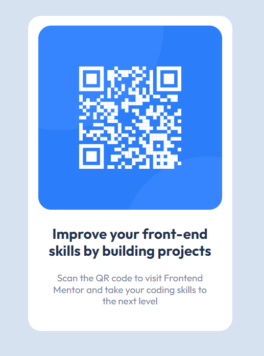

<h1> QR Component</h1>

Un pequeña practica de CSS, nunca esta de más regresar a lo básico

<h1>Preview del proyecto<h1>

  
  <h1>Recursos utilizados</h1>
  <ul>
    <li>
<a href="https://www.frontendmentor.io/home">Frontend Mentor</a>
</li>
    
Página Web donde podrás conseguir retos de Frontend. Muy recomendado!

  </ul>
  <h1>Código</h1>
  
Con toda libertad puedes bajar o clonar este repositorio!

  
Si tienes algún comentario o tienes una mejor forma de desarrollar el código, no dudes en comentarlo! Sharing Is Caring!

